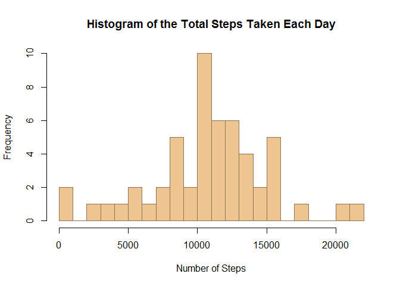

# Reproducible Research: Peer Assessment 1


## Loading and preprocessing the data
1. Load the data. Unzip activity.zip file if activity.csv does not exist.

```r
if (!file.exists("activity.csv")) {
        unzip("activity.zip")
}
```
2. Process the data into a data frame.

```r
cols <- c("numeric", "POSIXct", "numeric")
dat <- read.csv("activity.csv", na.strings = c("NA", ""), colClasses = cols)
```

## What is the mean total number of steps taken per day?
1. Calculate the total number of steps taken each day.

```r
sums <- aggregate(steps ~ date, data = dat, sum, na.rm = TRUE)
```
2. Make a histogram of the total steps taken each day.

```r
library(datasets)
hist(sums$steps, col = "burlywood2", border = "burlywood4", breaks = 20,
     main = "Histogram of the Total Steps Taken Each Day", 
     xlab = "Number of Steps")
```

 

1. Calculate and report the mean of "the total steps taken per day".

```r
ave <- mean(sums$steps, na.rm = TRUE)
print(ave)
```

```
## [1] 10766.19
```
The mean of the total steps is 10766.19 steps per 
day.

2. Calculate and report the median of "the total steps taken per day".

```r
med <- median(sums$steps, na.rm = TRUE)
print(med)
```

```
## [1] 10765
```
The median of the total steps is 10765 steps per 
day.

## What is the average daily activity pattern?
3. Calculate the mean steps in each 5-minute interval averaged across all days.

```r
daily <- aggregate(steps ~ interval, data = dat, mean, na.rm = TRUE)
```
4. Convert intervals to proper time format. (1970-01-01 is chosen for 
convenience in later calculations only)

```r
hr <- daily$interval %/% 100
min <- daily$interval %% 100
daily$interval <- as.POSIXct(paste("1970-01-01", hr, min), 
                             format = "%Y-%m-%d %H %M")
```
5. Make a time series plot of the 5-minute interval (x-axis) and the mean steps 
taken, averaged across all days (y-axis).

```r
locs <- c("1970-01-01 00:00:00", "1970-01-01 06:00:00", "1970-01-01 12:00:00", 
              "1970-01-01 18:00:00", "1970-01-02 00:00:00")
ticklocs <- as.POSIXct(locs, format = "%Y-%m-%d %H:%M:%S")
ticknames <- c("00:00", "06:00", "12:00", "18:00", "24:00")
library(lattice)
xyplot(steps ~ interval, data = daily, type = "l", xlab = "Interval", 
       ylab = "Number of Steps", 
       main = "Time Series Plot of the Daily Activity Pattern", 
       scales = list(x = list(at = ticklocs, labels = ticknames)))
```

 

6. Find the 5-minute interval that, on average across all the days in the dataset, 
contains the maximum number of steps.

```r
MAXstp <- max(daily$steps, na.rm = TRUE)
MAXint <- daily[which(daily[,"steps"] == MAXstp), "interval"]
substr(MAXint, 12, 16)
```

```
## [1] "08:35"
```
The 5-minute interval starting at 08:35 on average across 
all the days, contains the maximum number of steps.

## Imputing missing values
1. Calculate and report the total number of rows with missing values.

```r
NArows <- sum(!complete.cases(dat))
print(NArows)
```

```
## [1] 2304
```
The total number of rows with missing values is 2304.

2. Create an updated dataset with all NAs filled in. 
(Fill in each missing value with the mean for that 5-minute interval)

```r
dat2 <- dat
for (i in 1:nrow(dat2)) {
        if (is.na(dat2$steps[i])) {
                if (i%%288 == 0) {
                        dat2$steps[i] <- daily$steps[288]
                } else {
                        dat2$steps[i] <- daily$steps[i%%288]
                }
        }
}
```
3. Calculate the new total number of steps taken each day.

```r
sums2 <- aggregate(steps ~ date, data = dat2, sum)
```
4. Make a new histogram of the total steps taken each day.

```r
library(datasets)
hist(sums2$steps, col = "darkseagreen2", border = "darkseagreen4", breaks = 20,
     main = "New Histogram of the Total Steps Taken Each Day", 
     xlab = "Number of Steps")
```

 

5. Calculate and report the new mean of "the total steps taken per day".

```r
ave2 <- mean(sums2$steps)
print(ave2)
```

```
## [1] 10766.19
```
The new mean of the total steps is 10766.19.

6. Calculate and report the median of "the total steps taken per day".

```r
med2 <- median(sums2$steps)
print(med2)
```

```
## [1] 10766.19
```
The new median of the total steps is 10766.19 steps 
per day.

7. Do these values differ from the estimates from the first part of this report?

The mean (10766.19) remains the same as the estimate 
from the first part of this report, 
but the median (10766.19) differs slightly from the 
original estimate (10765).

8. What is the impact of imputing missing data on the estimates of the total daily 
number of steps?

I think the purpose of trying to imput missing data is to make the dataset more 
complete. As shown in this report, the filling-in of missing values has changed 
the median of total steps taken per day, though the difference between the 
original median and the new median is small. In a much larger dataset, the 
presence of missing data could contribute to a conclusion that is more deviated 
from the reality, thus leading to mistakes in making decisions based on the 
dataset. By filling in these missing values with possible data would give us a 
more complete picture of the real situations.

## Are there differences in activity patterns between weekdays and weekends?
1. Create a new factor variable in the dataset with two levels (“weekday” and 
“weekend”) indicating whether a given date is a weekday or weekend day.

```r
wkd <- weekdays(dat2$date)
dat2 <- cbind(dat2, wkd)
```
2. Set the system locale to English (US) if it is not.

```r
if (!Sys.getlocale(category = "LC_TIME") == "English_United States.1252") {
        invisible(Sys.setlocale(category = "LC_TIME", "English"))
}
```
3. Convert the interval in the new dataset to time format.

```r
dat2$interval <- daily$interval
```
4. Create a new factor column in the new dataset indicating which day in a week 
the date on the same row is; then use it to sort the dataset based on whether 
the date is a weekday or a weekend day.

```r
wkd <- weekdays(dat2$date)
dat2 <- cbind(dat2, wkd)
dat3 <- split(dat2, dat2$wkd)
wkdy <- rbind(dat3[[1]], dat3[[2]], dat3[[5]], dat3[[6]], dat3[[7]])
wkdy$wkd <- "weekday"
wknd <- rbind(dat3[[3]], dat3[[4]])
wknd$wkd <- "weekend"
dat3 <- rbind(wkdy, wknd)
```
5. Make a panel plot containing a time series plot of the 5-minute interval 
(x-axis) and the average number of steps taken, averaged across all weekday days 
or weekend days (y-axis).

```r
ave3 <- aggregate(steps ~ interval + wkd, data = dat3, mean)
library(lattice)
xyplot(steps ~ interval | wkd, data = ave3, type = "l", layout = c(1, 2), 
       xlab = "Interval", ylab = "Number of Steps", 
       main = "Time Series Plot of the Activity Patterns", 
       scales = list(x = list(at = ticklocs, labels = ticknames)))
```

 

Based on the panel plot generated above, it is easy to tell that there are 
some differences in activity patterns between weekdays and weekends mainly 
during the hours from 6 am to midnight.
